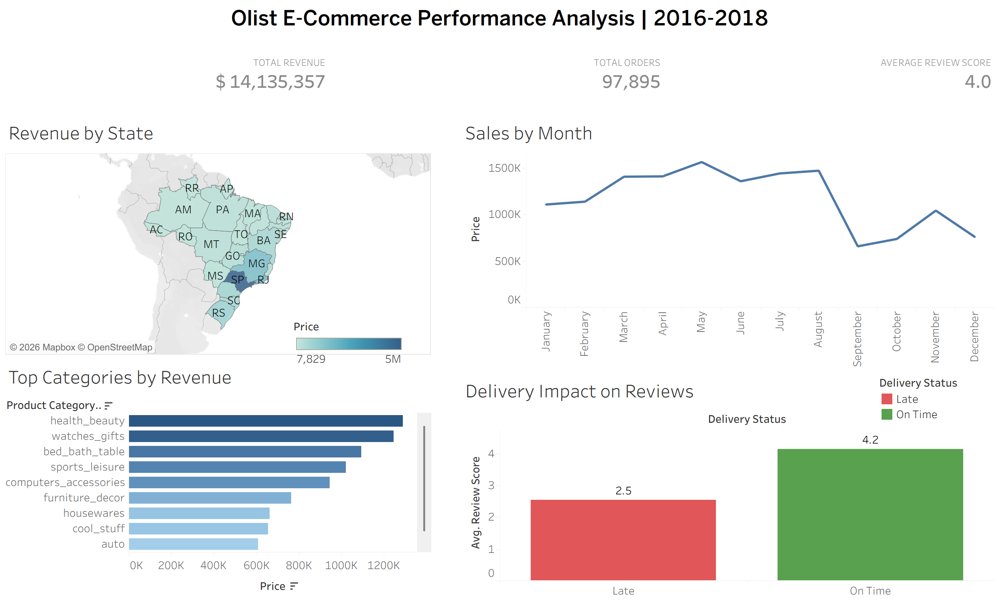

# Olist E-Commerce Performance Analysis | 2016-2018


## English

### Overview
End-to-end data analysis project using a real Brazilian e-commerce dataset (Olist) with over **100,000 orders** and **1.2 million rows** across 9 relational tables. The project covers the full data analytics workflow: ETL, relational database design, SQL analysis, and interactive dashboard.

### 🔗 Interactive Dashboard
👉 [View on Tableau Public](https://public.tableau.com/views/OlistE-CommerceAnalysis_17757742120520/Dashboard1)

### Key Findings
- **Monday** is the highest revenue day; **May** is the top-performing month
- **Health & Beauty** is the #1 category by revenue ($1.2M+)
- Late deliveries drop average review score from **4.2 to 2.5** out of 5
- **8.1%** of orders arrive late
- Customers in **PB, AC, RO** have the highest average ticket despite being smaller states
- Top seller generated **$228K** in revenue with 4/5 avg satisfaction

### Tech Stack
| Tool | Purpose |
|---|---|
| Python / Pandas | ETL — data cleaning and transformation |
| SQL Server | Relational database, views, stored procedures |
| Tableau Public | Interactive dashboard |

### Project Structure
```
olist-ecommerce-analysis/
├── etl_cleaning.py          # ETL pipeline for all 9 tables
├── 1_create_database.sql    # Database and table creation
├── 2_bulk_insert.sql        # Data loading to SQL Server
├── 3_analysis.sql           # Business questions analysis + Master View
├── 4_stored_procedures.sql  # Automated queries by state and category
├── 5_rfm_segmentation.sql   # RFM customer segmentation
└── dashboard_preview.png    # Dashboard screenshot
```

### Business Questions Answered
1. Which months and days have the highest sales volume?
2. Which product categories generate the most revenue?
3. What is the average ticket by state/region?
4. What percentage of orders arrive late — and how does it impact reviews?
5. Which sellers have the best and worst performance?

### Data Cleaning Highlights
- Removed **261,831 duplicate rows** from geolocation table
- Normalized **8,011 → 5,963** unique city name variations using Unicode normalization
- Handled **610 products** with missing category (filled as 'unknown')
- Fixed comma-separated values in city fields across multiple tables
- Preserved leading zeros in zip code fields by loading as string

---

## Español

### Descripción
Proyecto de análisis de datos end-to-end usando el dataset real de e-commerce brasileño Olist, con más de **100,000 órdenes** y **1.2 millones de filas** distribuidas en 9 tablas relacionales. El proyecto cubre el flujo completo de trabajo analítico: ETL, diseño de base de datos relacional, análisis SQL y dashboard interactivo.

### 🔗 Dashboard Interactivo
👉 [Ver en Tableau Public](https://public.tableau.com/views/OlistE-CommerceAnalysis_17757742120520/Dashboard1)

### Hallazgos Principales
- El **lunes** es el día con más ventas; **mayo** es el mes más fuerte
- **Salud y Belleza** es la categoría #1 por revenue (+$1.2M)
- Las entregas tardías reducen el score promedio de **4.2 a 2.5** sobre 5
- El **8.1%** de las órdenes llegan tarde
- Clientes en **PB, AC, RO** tienen el ticket promedio más alto pese a ser estados pequeños
- El mejor seller generó **$228K** con satisfacción promedio de 4/5

### Stack Tecnológico
| Herramienta | Uso |
|---|---|
| Python / Pandas | ETL — limpieza y transformación de datos |
| SQL Server | Base de datos relacional, vistas, stored procedures |
| Tableau Public | Dashboard interactivo |

### Limpieza de Datos
- Eliminación de **261,831 filas duplicadas** en geolocalización
- Normalización de **8,011 → 5,963** variaciones de nombres de ciudades
- Manejo de **610 productos** sin categoría (reemplazados por 'unknown')
- Corrección de valores separados por comas en campos de ciudad
- Preservación de ceros iniciales en códigos postales cargándolos como string
